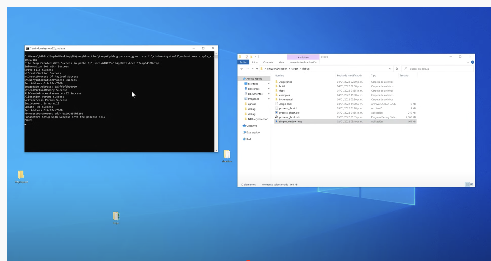
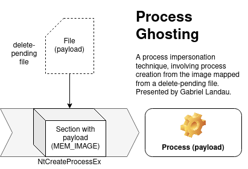

# process_ghost

Este proyecto tiene por objetivo generar un POC de Process Ghosting en Rust. 
Tecnica presentada por [Gabriel Landau](https://twitter.com/GabrielLandau):  
https://www.elastic.co/blog/process-ghosting-a-new-executable-image-tampering-attack

Modo de Uso

process_ghosting.exe  target  payload

target:  Ejecutable(PE)   para suplantar environment y parametros     
payload:  Ejecutable(PE) Codigo Malicioso.
<h1>Video Poc</h1>

Caracteristicas:
-
+ Artefactos de memoria como en  [Process Doppelgänging](https://github.com/hasherezade/process_doppelganging)
+ Payload mapeado como `MEM_IMAGE` (sin nombre: no linkeado a ningun archivo)
+ Secciones mapeados con permisos originales (no `RWX`)
+ Payload conectado al PEB como modulo principal
+ Inyeccion Remota soportada (Pero solo en un proceso recien creado)
+ El proceso es creado en un modulo sin nombre(`GetProcessImageFileName` retorna un string vacio)

<h1>Links de Inpsiración:</h1>

https://github.com/hasherezade/process_ghosting  
https://doc.rust-lang.org/stable/std/mem/fn.transmute.html
https://doc.rust-lang.org/std/ptr/index.html
https://gist.github.com/hfiref0x/a9911a0b70b473281c9da5daea9a177f

Este proyecto es únicamente para fines educativos y el autor no se hace responsable por su uso indebido.

